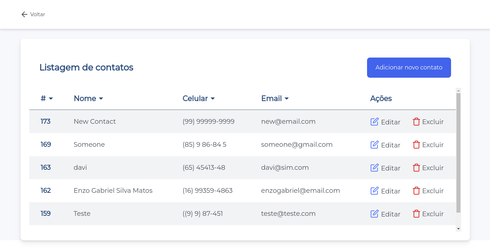
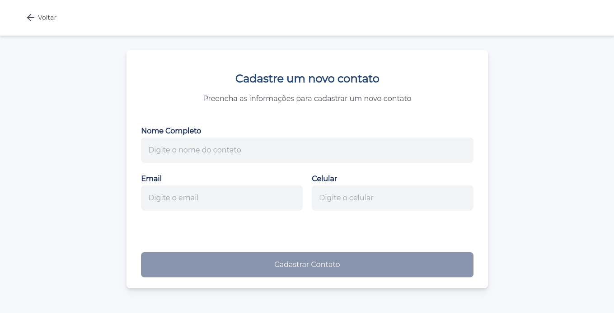
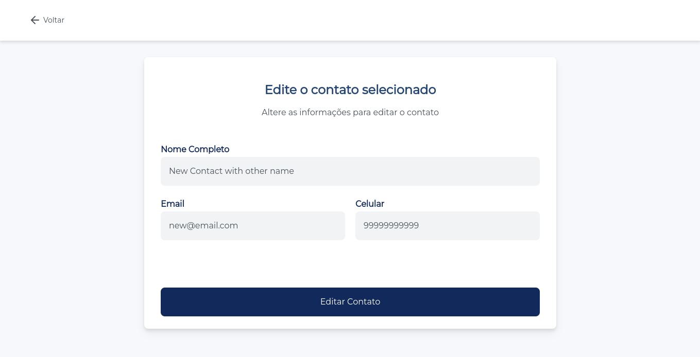
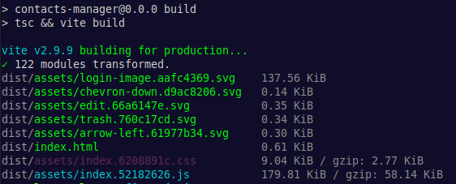
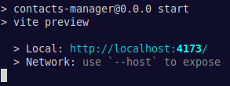
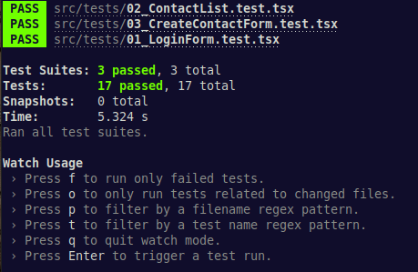

# Contacts Manager


> O Contacts Manager é uma aplicação web Front-end que te ajuda a gerenciar sua lista de contatos.

## ⚙️ Funcionalidades
* Ver sua lista de contatos cadastrados
* Adicionar novos contatos
  
* Editar as informações de um contato
  
* Excluir um contato da lista

## [Protótipo do projeto](https://www.figma.com/file/MlDF7BP1BgodRv0BO4EQ4C/Desafio?node-id=2%3A2)
## [Ícones utilizados no projeto](https://feathericons.com/)
## 🛠️ Tecnologias utilizadas
* [Vite](https://vitejs.dev/)
* [React](https://pt-br.reactjs.org/) (Hooks e Context)
* [TypeScript](https://www.typescriptlang.org/)
* [Tailwind CSS](https://tailwindcss.com/)
* [Axios](https://axios-http.com/ptbr/docs/intro)
* [ESLint](https://eslint.org/)
* [Prettier](https://prettier.io/)
* [Jest](https://jestjs.io/pt-BR/)
* [RTL](https://testing-library.com/)

## 🌱 Pré-requisitos
* Instale a última versão do [Node](https://nodejs.org/en/);
* Para garantir o funcionamento de todas as funcionalidades da aplicação é recomendado o uso do [Google Chrome](https://www.google.com/intl/pt-BR/chrome/);
* Para clonar o repositório instale e configure o [git](https://git-scm.com/).

## ▶️ Executando o projeto localmente
#### 1º Abra um terminal e faça o clone do projeto em sua máquina
```bash
git clone https://github.com/SP-Sam/contacts-manager.git

# Se você tem uma chave SSH configurada
git clone git@github.com:SP-Sam/contacts-manager.git
```
#### 2º Navegue até o diretório do projeto clonado
```bash
cd contacts-manager
```

#### 3º Instale as dependências do projeto
```bash
npm install
```
#### 4º Inicie o processo de build do projeto e aguarde até estar finalizado
```bash
npm run build
```
#### Você verá algo parecido com isso no terminal


#### 5º Inicie o projeto
```bash
npm start
```
#### Você verá algo parecido com isso no terminal


#### É só dar um `Ctrl+Click` no link ou colar `http://localhost:4173` no seu navegador e começar a usar!

## 🔓 Fazendo login no Contacts Manager


### Para fazer login na aplicação utilize as credenciais abaixo:
#### Email: `user@diwe.com.br`
#### Senha: `Mob20we23##`

## 🧪 Executando os testes do projeto
O Contacts Manager possui testes unitários. Para executa-los abra um terminal na raiz do projeto e rode o seguinte comando:
```bash
npm test
```
#### Você verá algo parecido com isso no terminal


#### os testes serão executados no `watch mode` do Jest. Para sair do `watch mode` basta apertar a tecla `q` ou `Ctrl+C`.

## 👨‍💻 Desenvolvedor
<a href="https://www.linkedin.com/in/spsam/">
  
  <br>
  <b>Samuel Pereira</b>
</a>

## 🖋️ Licença
Este projeto é um desafio técnico para um processo seletivo da empresa [DIWE](https://diwe.com.br/), não possui fins lucrativos e não está licenciado.

[⬆️ Voltar ao topo](#contacts-manager)
<br>
